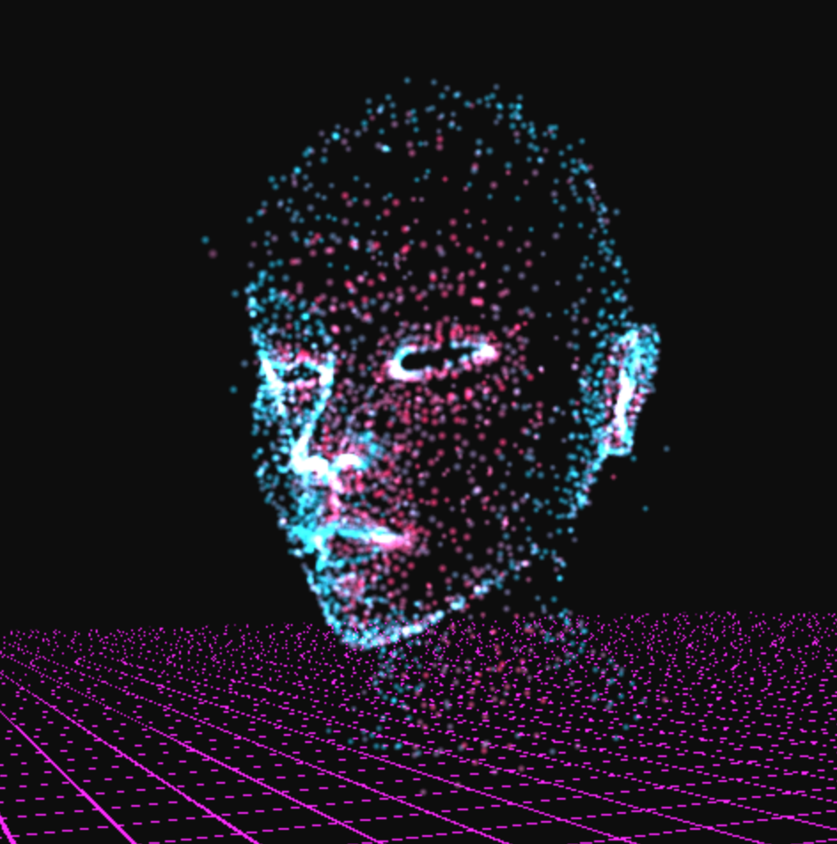
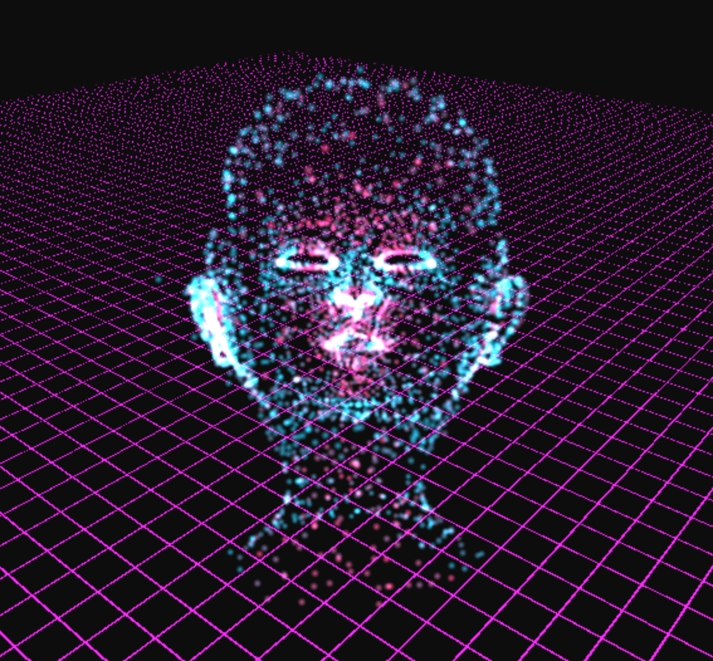
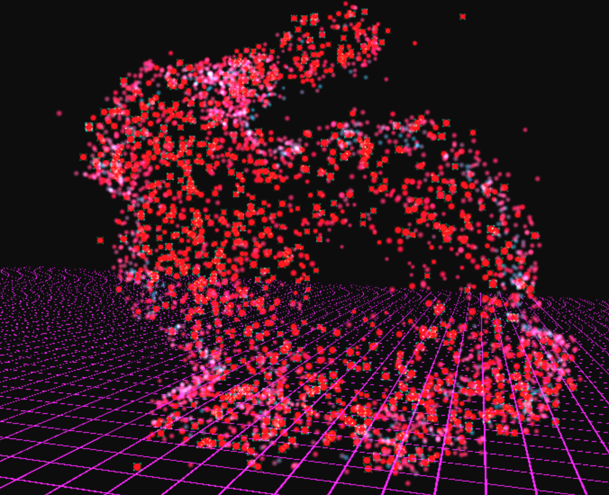

# Project 6: Particle System

Charles Wang\
PennKey: chawang

## Accidentally Somewhat Vaporwave and Naturally Glitchy Particle System

Some of this aesthetic was intential and some of it was not. Please decide for yourself.

[Live Demo](http://charlesliwang.com/homework-6-particle-system-charlesliwang/)

## Ｐｒｏｊｅｃｔ　Ｏｖｅｒｖｉｅｗ　ａｎｄ　Ｉｍｐｌｅｍｅｎｔａｔｉｏｎａｌ　ｄｅｔａｉｌｓ　ぼ蒸閲内の

The user can select one of three OBJs from the dropdown menu.\
The particles are pre-mapped to points on the OBJ's triangles, trying to map at least one particle to each triangle\
To attract the particles to the surface of the mesh, they undergo a fixed velocity towards their respective target points.\
Once the particle is within a threshold of the mesh surface, they are subject to a small random force for pulsing.\
The user can also enter a mode where each mouse click is a ray cast that repusles the particles.

The colors of the particles are determined by the surface normal of the triangle they target, their current velocity and some small noise.\
If the velocity of the particles go over a threshold (when they explode or transfer to a new mesh), their color starts to glitch out (a bug that turned into a feature)
